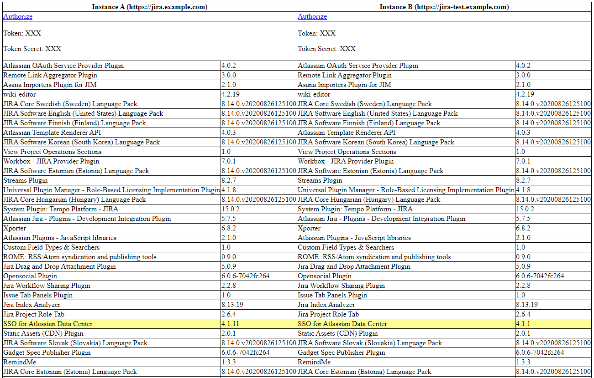

# Atlassian UPM Addon Version Compare
This tool helps in comparing the versions of installed Plugins between two Atlassian Software (Jira, Confluence)
instances. It uses OAuth to authenticate with the two instances and displays the installed Addons with their respective
versions. Addons that are only installed on one instance or that have differing versions, are highlighted.

## Screenshot

## Prerequisites
This uses [Poetry](https://python-poetry.org) for Packaging, so you will need to install it according to the docs.

## Setup
* Generate an RSA keypair, e.g. with openssl
* Configure an AppLink in the two instances with the public key
  * You can use two different keypairs or reuse the same for both
* Copy `config.sample.py` to `config.py` and set the required settings:
  * `base_url` is the URL you use to open the instance in a webbrowser
  * `client_key` is the Name of the App Link that you defined above.
  * `rsa_key` is the base64-encoded private key of the keypair from above. The example tries to load this from
`private-key.pem` in the current directory.
* Install the Dependencies with Poetry: `poetry install`
* Run the tool: `poetry run`
* Authorize with both instances by clicking the "Authorize" links at the top. This uses the currently logged in account 
to access the API.